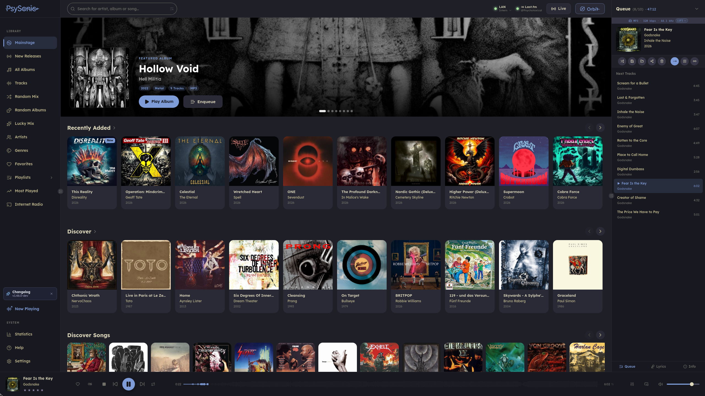
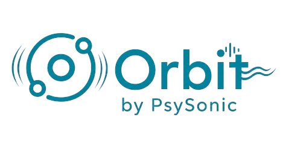

# Hydra Player

<div align="center">
  

## A modern desktop client for self-hosted music libraries

**Fast. Native. Beautiful. Built for people who actually care about their music collection.**

Psysonic is built primarily for **Navidrome** and also works with **Gonic**, **Airsonic**, **LMS** and other Subsonic-compatible servers, depending on the features supported by your server.

<br>

<a href="https://github.com/hydra-player/desktop/releases/latest"></a> <a href="https://github.com/hydra-player/desktop/stargazers"></a> <a href="https://github.com/hydra-player/desktop/blob/main/LICENSE"></a> <a href="https://tauri.app/"></a> <a href="https://discord.gg/AMnDRErm4u"></a> <a href="https://t.me/+GLBx1_xeH28xYTJi"></a> <a href="https://aur.archlinux.org/packages/hydra-player"></a> <a href="https://aur.archlinux.org/packages/hydra-player-bin"></a>

<br><br>

**No telemetry • Native performance • Navidrome-first • Community driven**

</div>

---



---

> [!WARNING]
> Hydra Player is under heavy active development. Bugs and rough edges are to be expected. We reserve the right to change, remove, or rework existing features at any time without prior notice.

## What is Psysonic?

**Hydra Player is optimized first and foremost for Navidrome.**

It is built with **Rust**, **Tauri v2** and **React**, with a strong focus on responsiveness, customization, practical music-library workflows and a user interface that does not require a manual before you can press play.

## Why Hydra Player?

Most Subsonic clients feel like web wrappers.

**Hydra Player does not.**

It is a true desktop experience built with **Rust**, **Tauri v2**, and **React** for users who care about speed, aesthetics, customization, and serious music library management.

If you host your own music, this is what the premium experience should feel like.

---

# Highlights

## Playback & Queue

* Gapless playback
* Crossfade
* ReplayGain support
* LUFS-based Smart Loudness Normalization
* [AudioMuse-AI](https://github.com/NeptuneHub/AudioMuse-AI) support
* Infinite Queue
* Smart Radio sessions
* Fast and responsive playback handling
* Low memory usage compared to heavy web-first clients

## Audio Tools

* 10-band Equalizer
* Equalizer presets
* AutoEQ headphone correction
* Per-device optimization
* Loudness-aware playback options

## Library Management

* Fast search across large libraries
* Albums, artists, tracks and genres
* Ratings support
* Multi-select bulk actions
* Drag & drop playlist management
* Smart Playlists
* Built for large self-hosted collections

## Lyrics & Discovery

* Synced lyrics with seek support
* Lyrics provider support: [YouLy+](https://github.com/ibratabian17/YouLyPlus), LRCLIB and NetEase
* Auto-scrolling sidebar lyrics
* Fullscreen lyric mode
* Last.fm scrobbling
* Similar artists
* Loved tracks and listening stats

## Sharing & Social Listening

* Magic Strings sharing:

  * share albums, artists and queues
  * Navidrome user management helpers
  * fast account sharing
* Orbit shared listening sessions:

  * host-controlled synchronized playback
  * session invites via link
  * guest song suggestions
  * real-time queue interaction

## Personalization & Accessibility

* Large theme collection
* Catppuccin and Nord inspired styles
* Glassmorphism effects
* Font customization
* Zoom controls
* Keybind remapping
* Theme Scheduler for automatic day/night switching
* Colorblind-friendly theme options
* Keyboard-friendly navigation

## Power User Extras

* CLI controls
* USB / portable sync
* Backup and restore settings
* In-app auto updater
* LAN / remote auto switching

---

<div align="left">
  
</div>

Orbit brings synchronized shared listening sessions directly into Psysonic.

Currently in final development and testing. Orbit will introduce synchronized shared listening sessions directly inside Hydra Player.

* Host-controlled playback
* Join via link
* Shared listening sessions
* Guest song suggestions
* Real-time queue interaction

**Rolling out in an upcoming release. Community feedback will help shape the final experience.**

---

# Platforms

| OS      | Support                                                         |
| ------- | --------------------------------------------------------------- |
| Windows | Native installer                                                |
| macOS   | Signed DMG                                                      |
| Linux   | AppImage / DEB / RPM / AUR (`hydra-player`, `hydra-player-bin`) / NixOS |

Psysonic supports **8 languages** and growing.

---

# Install

## Linux

```bash
curl -fsSL https://raw.githubusercontent.com/hydra-player/desktop/main/scripts/install.sh | sudo bash
```

Linux builds are also available through GitHub Releases, AUR and Cachix/Nix.

## Windows

Download the latest installer from the [GitHub Releases](https://github.com/Psychotoxical/psysonic/releases/latest).

## macOS

Download the signed DMG from the [GitHub Releases](https://github.com/Psychotoxical/psysonic/releases/latest).

---

# Development

```bash
git clone https://github.com/hydra-player/desktop.git
cd desktop
npm install
npm run tauri:dev
```

Build release:

```bash
npm run tauri:build
```

---

# Privacy

Psysonic is built for self-hosted music collections. Your library is yours.

* No telemetry
* No spyware nonsense
* No analytics harvesting
* No hidden tracking

---

# Community & Support

Join the community, report bugs, suggest features, share themes and help shape the future of Psysonic.

* [Discord](https://discord.gg/AMnDRErm4u)
* [Telegram](https://t.me/+GLBx1_xeH28xYTJi)
* [GitHub Issues](https://github.com/Psychotoxical/psysonic/issues)
* [Support Psysonic on Ko-fi](https://ko-fi.com/psychotoxic)

---

# License

Psysonic is licensed under the **GNU GPL v3.0**.

---

## Forks and Attribution

Psysonic is free and open-source software under the GPLv3. You are welcome to fork it, modify it and build upon it under the terms of the license.

If you publish a modified or rebranded version, please make it clear that your project is based on Psysonic and preserve proper attribution to the original project.

That is not about preventing forks. Forks are part of open source. It is about being honest with users and contributors about where the work comes from.

Features, design work and implementation ideas developed in Psysonic should not be presented as unrelated original work in downstream projects.

---

<div align="center">

## Own your music. Enjoy the client too.

## Use Hydra Player.

</div>